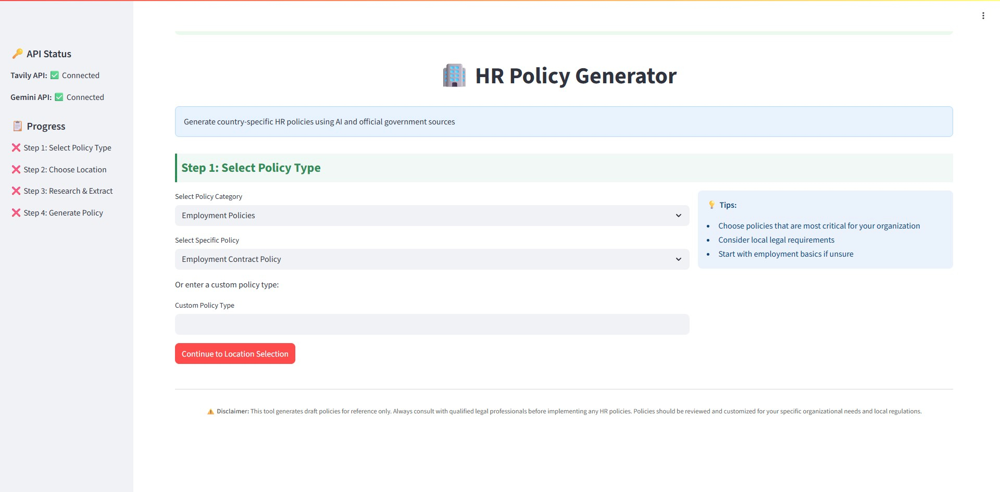

# 🏢 HR Policy Generator

Generate comprehensive, legally compliant, country-specific HR policies using AI and verified official sources.  
This tool uses **Streamlit**, **Google Gemini**, **Tavily Search API**, and **Selenium** to automate policy creation based on official government data.

---



---

## 🚀 Features

- ✅ AI-generated HR policies tailored to a specific country or region  
- ✅ Integrated legal research using Tavily search API  
- ✅ Content extraction from government and regulatory sites using Selenium  
- ✅ Dynamic Streamlit interface with step-by-step UI  
- ✅ Downloadable output in `.txt` and `.md` formats  

---

## 🧱 Tech Stack

- Python 3.11+
- Streamlit
- Selenium
- Google Generative AI (Gemini)
- Tavily API
- dotenv

---

## 🔧 Installation

### 1. Clone the repository

```bash
git clone https://github.com/yourusername/hr-policy-generator.git
cd hr-policy-generator
```

### 2. Set up a Python environment

```bash
python -m venv .venv
source .venv/bin/activate        # On Windows: .venv\Scripts\activate
```

### 3. Install dependencies

```bash
pip install --upgrade pip
pip install -r requirements.txt
```

### 4. Create a `.env` file

```env
TAVILY_API_KEY=your_tavily_api_key
GEMINI_API_KEY=your_gemini_api_key
```

> 🔐 Do **not** commit your `.env` file to version control.

---

## 💻 Running the App

```bash
streamlit run app.py
```

By default, the app runs at:  
[http://localhost:8501](http://localhost:8501)

---

## 🌐 For Linux Headless Servers

Install the required Chromium and system dependencies:

```bash
sudo apt update
sudo apt install -y chromium-browser chromium-chromedriver
sudo apt install -y fonts-liberation libasound2 libatk-bridge2.0-0 libdrm2 libxcomposite1 \
libxdamage1 libxrandr2 libgbm1 libxss1 libnss3
```

The app also attempts to install these automatically if not found.

---

## 🧠 AI Models Used

- **Tavily API** – for legal document search and extraction  
- **Gemini (Google Generative AI)** – for HR policy document generation

---


---

## 📂 Project Structure

```
├── app.py                # Main Streamlit app
├── requirements.txt      # Python dependencies
├── README.md             # This file
├── .env                  # API keys (you create this)
```

---

## 📄 Output Format

The generated HR policy includes:

- ✅ Title and version  
- ✅ Effective date  
- ✅ Table of contents  
- ✅ Structured sections (Purpose, Scope, Definitions, Procedures, Compliance)  
- ✅ Appendices and legal references  

You can download the policy as:

- 📄 Plain text (`.txt`)  
- 📝 Markdown (`.md`)

---

## ⚠️ Disclaimer

> This tool is intended for **drafting and research purposes only**.  
> All HR policies **must be reviewed by qualified legal counsel** before implementation.  
> Ensure compliance with **local labor laws and regulations**.

---

## 🙋‍♂️ Author & License

**Author:** Martin Schoeman
**License:** Open Source  
**Contributions:** PRs and issues welcome!

---
